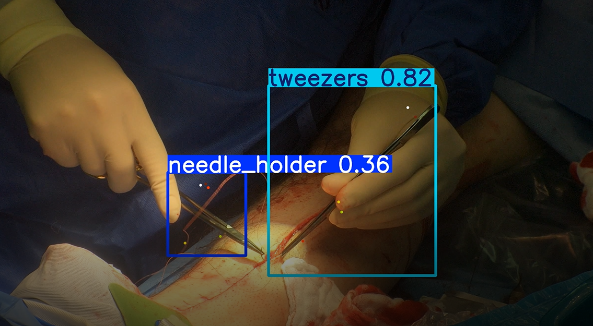
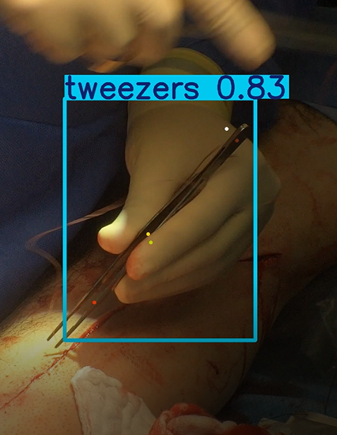
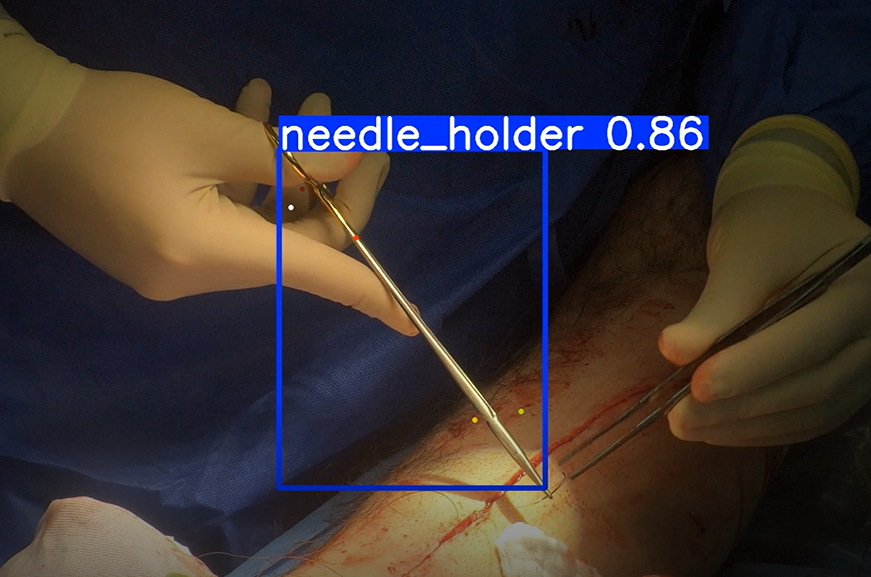

# Computer Vision for Surgical Tools — 2D Pose Estimation 
(Estimations using synthetic images only)

<p align="center">
  <b>Phase 1:</b> Synthetic Data generation &nbsp;•&nbsp;
  <b>Phase 2:</b> Train & Evaluate &nbsp;•&nbsp;
  <b>Phase 3:</b> Unsupervised Refinement on Real Video
</p>

[]()
[]()
[]()
[]()

---

## Project Intro

This repository develops a **2D pose estimation system** for surgical instruments using synthetic data first, then adapts to real, unlabeled videos.

- **Goal:** Detect per-tool keypoints and poses in 2D images/videos.
- **Key challenges:** Occlusion, articulation, domain gap, and real-time constraints.
- **Approach:** Synthetic data ➜ train on synthetic ➜ refine on unlabeled real video (self-training / pseudo-labels).

---
## ⬇️ Weights & Artifacts

Phase 2 weights: [Download part 2 weights](https://raw.githubusercontent.com/brarbrb/Synthetic-data/main/part2_best.pt)


Phase 3 weights: [Download part 3 weights](https://raw.githubusercontent.com/brarbrb/Synthetic-data/main/part3_best.pt)

Videos:
Due to file size limitation we uploaded both videos to the following One Drive folder:
[One Drive link](https://technionmail-my.sharepoint.com/:f:/g/personal/galavidar_campus_technion_ac_il/Eh-3eWUM5yhAuNl11KZu-Y4BLaKgtJOIW6KxJa1k71yN-w?e=yV6pUz)

### ⚠️ Important Notes
1. In this folder you can find also ZIP folder with the blend tools used in Part 1. Unzip the folder to use them!
   
2. The video `results_synthetic_only.mp4` has only 10% of frames of the video labeled. Almost invisible!
   We explained in our final report that we've run a a sccript `Part3/run_pred.py` that saves only the frames that had any detections. Afterwards in `Part3/refine.ipynb` we    run predictions on these frames to get annotated images and labels (automatically in yolo format). We saved the annotated images and labels in Part3/fine_tune/pseudo_v1 on vm (we can't upload it due to weight restrictions)

## 📷 Video and Images and Prediction Scripts

`video.py` - This script runs YOLO object for pose detection on a video file and saves the annotated result as an output video.

###  Run on a Video File
```bash
python video.py \
--weights part3_best.pt \ # or other weights, this is default
--source /path/to/your/video.mp4 \
--output results.mp4
```

`predict.py` - This script runs YOLO object for pose detection and saves the annotated result as an image.

### Run on Images
```bash
python video.py \
--weights part3_best.pt \
--source /path/to/your/image.png \ # or jpg, jpeg etc.
--output img_name.mp4
```


- `--weights`: Path to your YOLO `.pt` model file
- `--source`: Path to a video file
- `--output`: Output path for the saved annotated video/image


---

## 📁 Repository Structure 
```text
.
├─ Part1/                    
│  ├─ rendering_{type of rendering}.py     - there are multiple files that create different kinds of rendering
|  ├─ obj_features.py              - Exploring provided .obj and .mtl files
|  ├─ overlay_coco_kps.py         - draws key points on images of tools
|  └─ paste_on_random_background.py
|
├─ Part2/                      
│  ├─ training_model.ipynb 
│  ├─ data_config.yaml
│  ├─ coco_to_yolo_pose.py        - converter from coco annotations to yolo
│  └─ runs/                      - logs, checkpoints, metrics (automatic yolo logs)
|
├─ Part3/                   
│  ├─ refine.ipynb                  - pseudo-label loop
│  └─ runs_refined/
|
├─ inference/
│  ├─ predict.py                 - image inference
│  └─ video.py                   - video inference (OpenCV)
|
├─ rendered_imgs_exampless/  - folder with examples of different renderings
│  ├─ ...
│  └─ images.png       
|
├─ synthetic_data_generator.py       - renders .blend files + calculates kp position  + adds random occluders + saves in coco
├─ video.py
├─ predict.py 
├─ requirements.txt
├─ part2_best.pt        - weights from yolov8s only on synth data  
├─ part3_best.pt          - yolov8s after refinement - had the best performance
├─ camera.json       - intrinsics for rendering
└─ README.md
```
Provided resources (we had on the VM in /datashare/project):

 - 3D CAD models (.obj) of tools (with articulation)

 - Backgrounds: COCO 2017; Textures/HDRI: Polyhaven

 - Unlabeled videos: (4_2_24_A_1.mp4, etc.)


### Saving the datasets
For 2D pose estimation with two object classes (needle holder and tweezers) and synthetic data it ws important to save the dataset in one general, model-agnostic format so we coudld later convert it to whatever a specific model requires.

Our final structure is: 
1. For annotations: COCO format (JSON) – supports multiple objects per image, multiple keypoints per object, segmentation masks if needed.

2. We used next folder structure: (we converted it later to yolo format) 
```
dataset/
├── train/
│   ├── images/
│   │   ├── img_00001.png
│   │   ├── img_00002.png
│   │   └── ...
│   └── coco_keypoints.json COCO-style annotations for training
│
└── val/   # the same structure here
```

4. Our annotations were saved in coco-jsonlike this: 
```
{
  "images": [
    {"id": 1, "file_name": "img_00001.jpg", "width": 640, "height": 480}
  ],
  "annotations": [
    {
      "id": 1,
      "image_id": 1,
      "category_id": 1,
      "bbox": [x, y, w, h],
      "area": 1234,
      "iscrowd": 0,
      "keypoints": [x1, y1, v1, x2, y2, v2, ...], 
      "num_keypoints": 5
    }
  ],
  "categories": [
    {
      "id": 1,
      "name": "needle_holder",
      "keypoints": ["joint","left_handle","left_tip","right_handle","right_tip"],
      "skeleton": [[0, 1], [0, 2], [0, 3], [0, 4]]   
    },
    {
      "id": 2,
      "name": "tweezers",
      "keypoints": ["handle_end","left_arm","left_tip","right_arm","right_tip"],
      "skeleton": [[0, 1], [0, 2], [1, 3], [2, 4]]
    }
  ]
}
```

---
# The work flow

## Phase 1 — Synthetic Data Generation

**What we did:**

 1. Defined keypoints for each instrument (using Blend)
 2. Created multiple BlenderProc rendering pipelines:
   - rendering_KP.py and rendering_hdri_KP.py: no occlusions.
   - rendering_kp_occlusions.py and rendering_hdri_kp_occlusions.py: added random occluders.
   - additional_rendering.py: most helpful script, added material variations and forced at least one keypoint occluded. - this is what is saved explicitly in `synthetic_data_generator.py` 

3. Generated 1500–2500 synthetic images with variations in pose, articulation, lighting, and backgrounds.

**Findings:**

- Models trained only on synthetic data with no occlusions achieved perfect results on synthetic validation, but failed completely on real video (thanks to the domain gap).

- Adding occlusions helped slightly but was not enough.

- The most useful change was additional rendering with occluded keypoints and domain-specific material tuning.

## Phase 2 — Training & First Evaluation

1. Used YOLOv8 keypoint models (yolov8s-pose and yolov8m-pose).

2. Augmentations tuned to surgical domain (scale, translate, perspective, HSV).

3. Training parameters (example):

python training/train.py \
  --data_dir synthetic/output \
  --epochs 100 \
  --batch 16 \
  --imgsz 960 \
  --weights yolov8s-pose.pt


4. Experiments:

 - yolov8s-pose trained on 1500 no-occlusion images → good synthetic accuracy, but 0 detections on real video.

 - yolov8m-pose trained on 2500 occlusion images → also failed on real video.

After retraining with additional_rendering.py + domain-specific augmentations →
both models started detecting something in ~10% of frames on real video. 

## Phase 3 — Refinement & Final Evaluation

Strategy: unsupervised refinement using pseudo-labels.

Steps:

- Ran inference with run_pred.py on real video → saved all frames with any detection.
- Used refine.ipynb to collect ~120 best pseudo-labeled frames.
- Added extra forced-occlusion images (200 train + 100 val) to strengthen robustness.
- Retrained using only yolov8s-pose (lighter, similar performance to m).

**Final Results:**
1. Model improved significantly.
2. It now detects most instruments in the video.
3. Pose estimation is not perfect, but good enough given the domain gap






